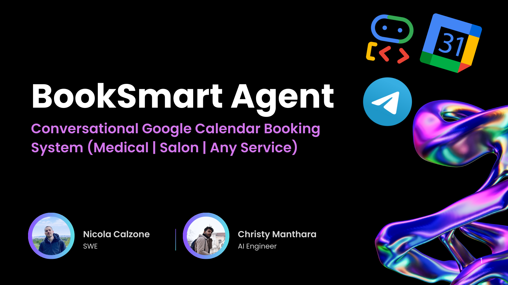
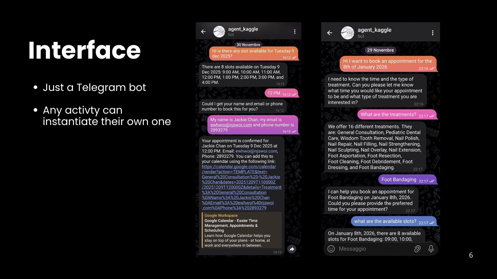
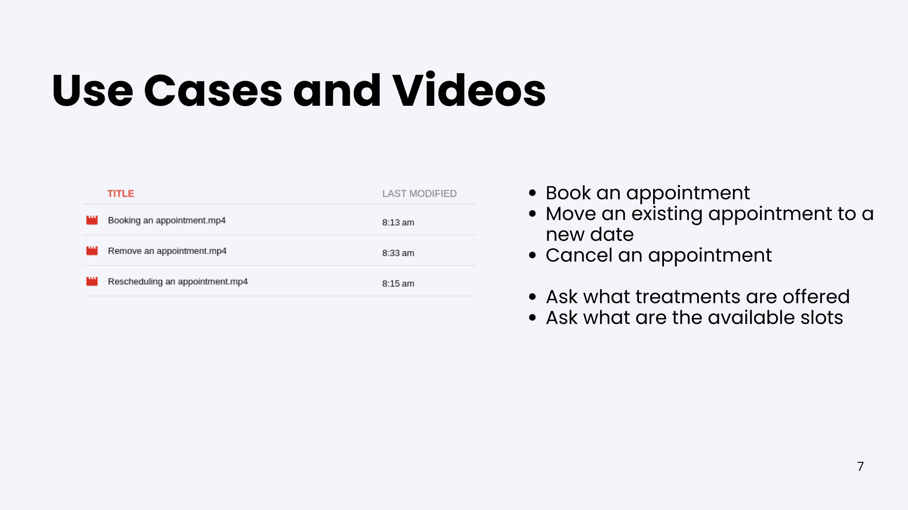

# BookSmart - Appointment Booking Multi-Agent System  

A robust, multi-turn appointment booking system powered by Google Agent Development Kit (ADK). Supports medical clinics, salons, law firms — any service that needs to book, reschedule or cancel time slots with real-time availability.

## Features
- Fully conversational booking via Telegram (multi-turn)
- Real-time conflict detection & smart alternative slot proposals
- Direct Google Calendar API integration (no external dependencies)
- Timezone-aware scheduling (Europe/Rome)
- Business hours validation (9 AM - 5 PM, Mon-Fri, excluding holidays)
- Session persistence with ADK resumability
- Implicit context caching - automatic cost reduction in Gemini 2.5
- Clean multi-agent architecture (General → Calendar → CorrectorAgent/AppointmentCRUD)

## Architecture Overview

```
Telegram User
  ↓
TELEGRAM_AGENT (message interface)
  ↓
general_agent (LlmAgent)                     ← router
├── treatments_info_agent (LlmAgent)
└── calendar_agent (LlmAgent)                 ← smart orchestrator
     ├── parse_then_find_agent (SequentialAgent)   ← safe sequential chain
     ├── booking_executor_agent (LlmAgent)         ← dumb final executor
     └── date_parser_agent (only used standalone when canceling, etc.)
        
All tools use google-api-python-client for direct Google Calendar API access
```

## Project Structure

```
.
├── agents/
│   ├── __init__.py            # Shared ADK imports (LlmAgent, Gemini, etc.)
│   ├── general_agent.py       # Entry point, wraps calendar_agent
│   ├── calendar_agent.py      # Main orchestrator with sub-agents
│   └── telegram_agent.py      # Telegram bot interface with LRO support
├── tools/
│   └── calendar_tools.py      # Google Calendar API functions
├── config/
│   ├── credentials.json       # Google OAuth credentials
│   └── token.json             # Generated OAuth token
├── telegram_main.py           # Telegram bot entry point
├── test_cache.py              # Test context caching functionality
├── requirements.txt
└── README.md
```


## USE CASES

### Booking

[(https://youtu.be/v3IPiA3jSa4)
[(https://youtu.be/rN6lQHEzuew)
[(https://youtu.be/t8ux50m9qfA)


## Session Management with ADK

The system uses ADK's built-in resumability for multi-turn conversations:

- **InMemorySessionService**: Maintains conversation state per user
- **ResumabilityConfig**: Enables pause/resume for long-running operations
- **Tool Confirmation Flow**: Handles user approval for alternative time slots

Example: When a requested time is occupied, the tool pauses execution and asks for user confirmation. The user's "yes/no" response resumes the exact tool execution with the approved alternative.

## Calendar Tools (tools/calendar_tools.py)

### Core Functions

```python
def check_availability(date: str, time: str, tool_context: ToolContext) -> dict:
    """Checks if slot is free. If occupied, pauses and proposes alternative.
    Returns: {'status': 'approved'|'pending'|'rejected', 'is_available': bool, ...}
    """

def find_next_available_slot(date: str, time: str, max_attempts: int = 10) -> dict:
    """Searches forward in 1-hour increments for next free slot.
    Returns: {'status': 'approved'|'rejected', 'available_date': str, 'available_time': str}
    """

def insert_appointment(full_name: str, email: str, phone: str, date: str, time: str, ...) -> dict:
    """Creates Google Calendar event with final availability check.
    Returns: {'status': 'approved'|'rejected', 'order_id': str, 'link': str, ...}
    """

def move_appointment(email: str, phone: str, new_date: str, new_time: str, ...) -> dict:
    """Reschedules appointment with availability check. Can pause for user confirmation.
    Returns: {'status': 'approved'|'pending'|'rejected', ...}
    """

def delete_appointment(email: str = None, phone: str = None) -> dict:
    """Cancels appointment by email or phone.
    Returns: {'status': 'approved'|'rejected', 'order_id': str, ...}
    """

def parse_date_expression(expression: str) -> dict:
    """Parses natural language dates: "tomorrow", "next Tuesday", "28 11 2025", etc.
    Returns: {'status': 'success'|'error', 'date': 'YYYY-MM-DD', 'day_name': str, ...}
    """

def get_current_date() -> str:
    """Returns current date and time for LLM context."""

def is_it_in_work_hours(date: str, time: str) -> bool:
    """Validates 9 AM - 5 PM, Mon-Fri, excluding holidays."""
```

All functions use `google-api-python-client` with OAuth credentials and Europe/Rome timezone.

## Setup & Running

### Prerequisites
1. Google Cloud project with Calendar API enabled
2. OAuth 2.0 credentials (download as `config/credentials.json`)
3. Telegram Bot Token (from @BotFather)

### Installation

```bash
# 1. Clone & install dependencies
git clone https://github.com/nicolacalzone/secretary_agent
cd secretary_agent
pip install -r requirements.txt

# 2. Set up Google Calendar credentials
# Place credentials.json in config/
# First run will open browser for OAuth authorization
mkdir config/
touch credentials.json #copy here the calendar OAuth Client content

# 3. Configure Telegram bot
# configure it like `.env example` file
touch .env

# 4. Run the bot
python telegram_main.py
```

### First Run
On first execution, the system will:
1. Open a browser for Google OAuth authorization
2. Start the Telegram bot (you must have created one with @BotFather)

### Usage Examples

**Booking:**
```
User: I need to book for the 12 December 2025 at 10:00. I am John Doe, email: john@example.com, phone: 12345
Bot: ✅ Your appointment is confirmed for 2025-11-28 at 10:00
```

**Rescheduling:**
```
User: Reschedule my appointment for tomorrow at 2pm, email: john@example.com
Bot: I'm sorry, but 14:00 on 2025-12-03 is occupied. Alternative: 15:00 on 2025-12-03. Book that instead?
User: yes
Bot: ✅ Appointment rescheduled to 2025-12-03 at 15:00
```

**Canceling:**
```
User: Cancel my appointment on the 4 December, my email is john@example.com
Bot: ✅ Appointment cancelled successfully
```

## Key Implementation Details

### Timezone Handling
All datetime objects use `ZoneInfo('Europe/Rome')` to ensure correct local time interpretation when querying Google Calendar API.

### Availability Checking with LRO
When a time slot is occupied, `check_availability` uses ADK's `tool_context.request_confirmation()` to pause execution and wait for user approval of an alternative slot. This prevents race conditions and ensures atomic operations.

### Natural Language Date Parsing
The system handles multiple date formats:
- Relative: "tomorrow", "next Tuesday", "in 3 days"
- Numeric: "28 11 2025", "28/11/2025"
- Month names: "28 November 2025", "December 5"
- ISO: "2025-11-28"

Time formats supported: "10:00", "10.00", "10", "3pm", "1 pm"

## Production Considerations

- **Error Recovery**: Telegram agent extracts partial responses even when TypeError occurs
- **Work Hours Validation**: All bookings validated against 9 AM - 5 PM, Mon-Fri schedule
- **Holiday Detection**: Automatically blocks Christmas, New Year, and weekends
- **Session Isolation**: Each Telegram user gets isolated session with unique ID
- **Idempotency**: Use event IDs to prevent duplicate bookings
- **Implicit Caching**: Gemini 2.5 automatically caches repeated context, user info prepended to trigger cache hits
- **Clean Logging**: INFO level for user messages and agent instructions only